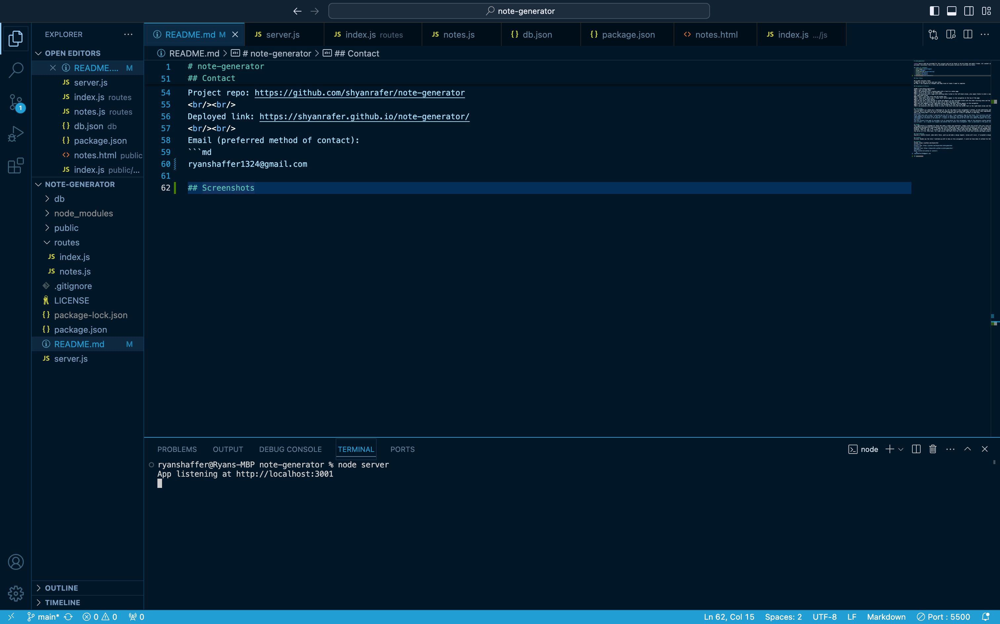
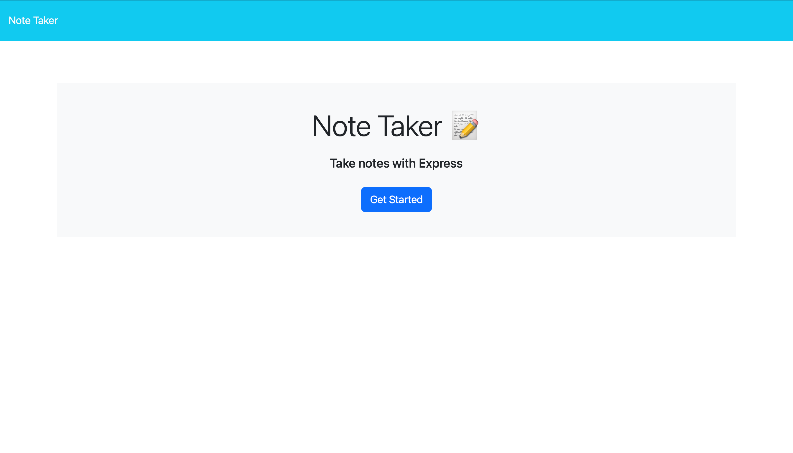
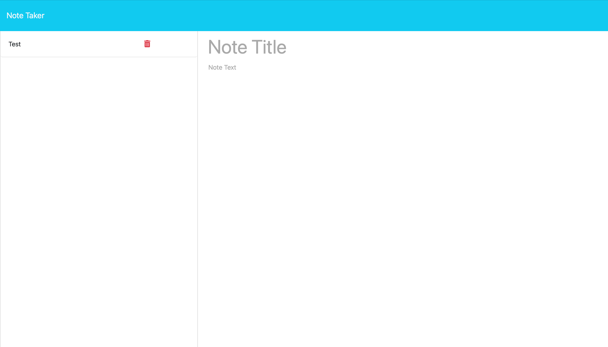
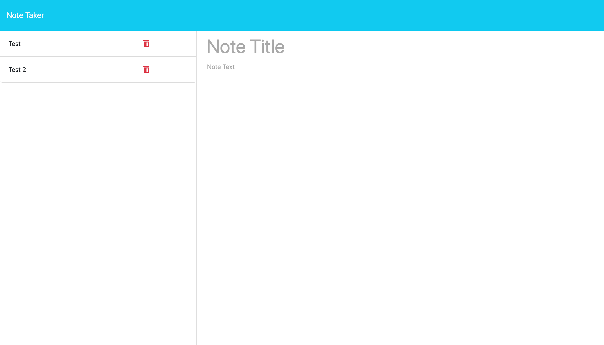
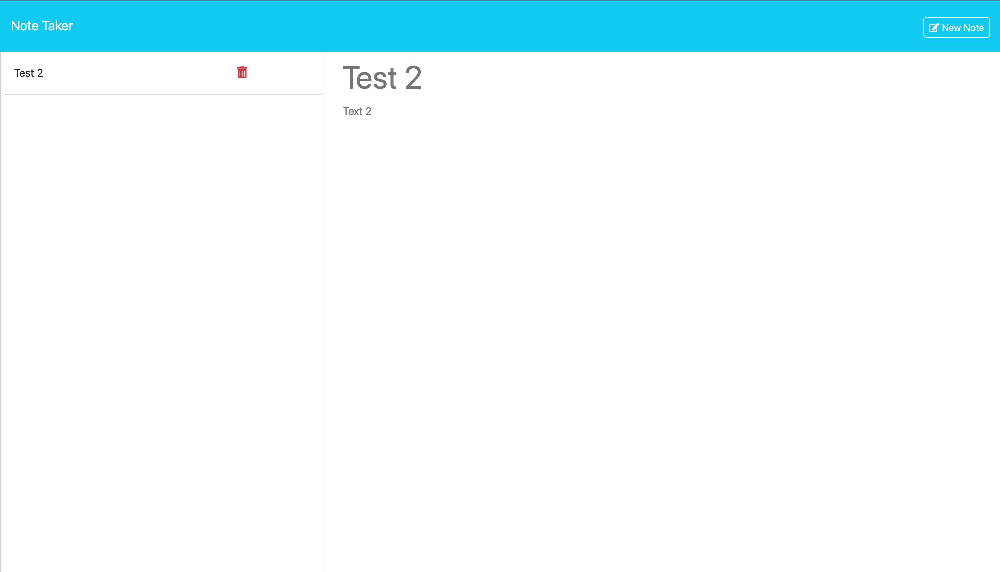

# note-generator

*note* Source code was provided for this project and can be found in the db folder and public folder. All content in the aforementioned locations was provided. Assistance from a tutor was provided and the given sections are outlined via notes. 

## Table of contents
- [Challenges](#challenges)
- [Usage](#usage)
- [Contributing](#contributing)
- [Credits](#credits)
- [Contact](#contact)
- [Screenshots](#screenshots)

## User Story

AS A small business owner
I WANT to be able to write and save notes
SO THAT I can organize my thoughts and keep track of tasks I need to complete

## Acceptance Criteria

GIVEN a note-taking application
WHEN I open the Note Taker
THEN I am presented with a landing page with a link to a notes page
WHEN I click on the link to the notes page
THEN I am presented with a page with existing notes listed in the left-hand column, plus empty fields to enter a new note title and the note’s text in the right-hand column
WHEN I enter a new note title and the note’s text
THEN a "Save Note" button and a "Clear Form" button appear in the navigation at the top of the page
WHEN I click on the Save button
THEN the new note I have entered is saved and appears in the left-hand column with the other existing notes and the buttons in the navigation disappear
WHEN I click on an existing note in the list in the left-hand column
THEN that note appears in the right-hand column and a "New Note" button appears in the navigation
WHEN I click on the "New Note" button in the navigation at the top of the page
THEN I am presented with empty fields to enter a new note title and the note’s text in the right-hand column and the button disappears

## Challenges 
This assignment as a whole was a challenge for me. For the week of this assignment's content, we had substitutes and I had overtime at work. Their lectures were a bit hard for me to follow and coupling that with working loads made for a difficult time comprehending the material. I thought I knew what I was doing when I first got to it but after plugging away for a while I decided I'd need help.
<br/><br/>
After some talk with a tutor I realized how far off I was. I had a general idea of the files, file structure and the syntax necessary for the requirements to be fulfilled. It was just a matter of where do I put things and what am I missing. The session with the tutor provided a chance to be challenged and refreshed on the material. A couple of notes/gems shared by the tutor were added throughout the project via notes. 
<br/><br/>
The mini project from week 11 provided a lot of inspiration for this assignment. Some of the necessary syntax matched that of which was in the week 11 mini project - so I copied the snippets and edited them to befit this assignment. That is mentioned in the given area of the assignment. 

## Usage 
This application is intended for those who need a simple note generator. Simply clone the project onto your local device by running /git clone git@github.com:shyanrafer/note-generator.git/ after navigating to your desired file location in your CLI. From there, assuming you've the proper plug-ins installed, run /code ./ to open the file in your given code writing interface. Navigate to the package.json file, open in integrated terminal, then run /npm i/ to install all of the given npm packs. After packs have been installed, close that terminal session and then open one on the server.js file. Once done, run /node server/ and then click the link to the local host session and begin using the application. 

## Contributing
Gnerate a feature branch, make edits there, push up and make a merge request, review will occur, if accepted a merge will be conducted. 

## Credits
Alistair Rowden was the tutor I matched up with to help on this assignment. I could not have done it without his help. 

## Contact
Github: https://github.com/shyanrafer
<br/><br/>
Project repo: https://github.com/shyanrafer/note-generator
<br/><br/>
Deployed link: https://shyanrafer.github.io/note-generator/
<br/><br/>
Email (preferred method of contact): 
```md
ryanshaffer1324@gmail.com

## Screenshots
 



